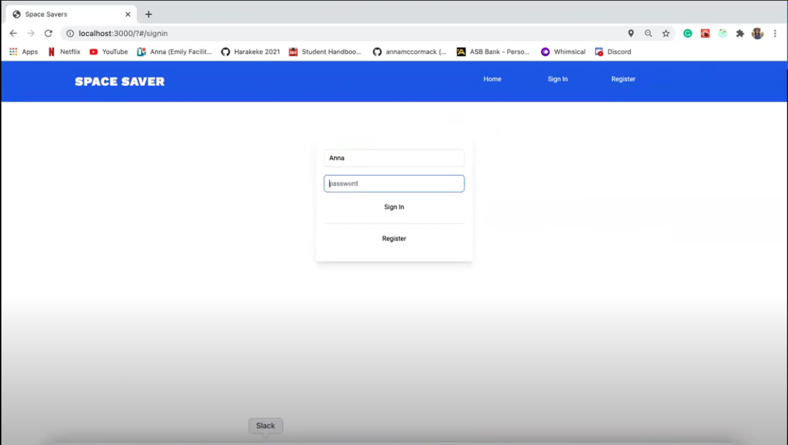

# Space Saver

Enspiral Dev Academy Final Project
Team built web app focused on bringing provision and simplicity to parking for commuters
The following technologies were utilized 

## TECHNOLOGIES 

 - JavaScript 
 - React
 - Redux
 - SQLite3
 - GOOGLE MAPS API
 - Knex.js
 - Node.JS
 - Express.JS
 - SuperAgent.JS
 - Tailwind
 - Playwright
 - Jest.js

## PRESENTATION

 Click on the link provided to view a presentation of the final product.
 
 LINK: https://www.youtube.com/watch?v=EokYrULrYoQ

## INTRODUCTION

Its a Auckland anniversary. It's a hot summers day and you want to head to the beach, So does everyone else. You get to the beach and you think gee whiz im going to be walking for km to find a park anywhere near.

SpaceSaver

You're heading to watch the Allblacks play at eden park. So is every other Kiwi in auckland and you know you aren't going to be able to find a park anywhere near and if you do its going to cost you an arm and a leg.

SpaceSaver

We here at SpaceSaver want to give property owners the chance to earn a bit of money and offer up their parking spot when they're not using it.

We here at SpaceSaver want to give the general populace the chance to park closer to their destination without paying extortionate prices.

## ScreenShots 

Authentication/ Log on Screen . . .

GeoLocation/ Search Area function . . .

Owner Dashboard . .

Parker Dashboard . . .

Add Park / Edit || Delete Park . . . 

## Team Roles
Clinton: Frontend lead & animation
Pete: Vibes master & Product lead
Anna: Git lead & styling 
Peter: Backend lead

 
## Git flow:
Main => Dev => Feature branches 
Peer review before pushing to dev 
Code review before pushing to main 

## Definition of done:
Passing tests
Peer reviewed 

